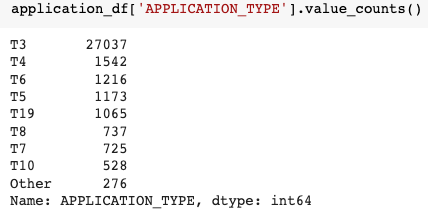
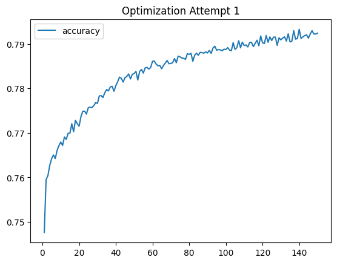

# deep-learning-challenge


Results: Using bulleted lists and images to support your answers, address the following questions:


How many neurons, layers, and activation functions did you select for your neural network model, and why?
Were you able to achieve the target model performance?
What steps did you take in your attempts to increase model performance?
Summary: Summarise the overall results of the deep learning model. Include a recommendation for how a different model could solve this classification problem, and then explain your recommendation.

## Overview
This purpose of this analysis was to use a neural network model to identify whether recipient organisations of seed funding will be successful. The model has been trained and tested on a .csv file of 34,000 organisations that have previously received funding.

## Results
- To approach this, a base model was trained and tested, followed by three, stepped Optimization attempts.

### Pre-processing
- The target variable used in training and testing the model was the variable ``is_Successful`` indicating success outcome as 1 - Successful and 0 - not successful.

The input variables used to train and test the model included:

``NAME``

``APLICATION_TYPE`` 

``AFFILIATION`` - Affiliated sector of industry

``CLASSIFICATION`` - Government organisation classification

``USE_CASE`` - Use case for funding

``ORGANIZATION`` - Organisation type

``STATUS`` - Active status

``INCOME_AMT`` - Income classification

``SPECIAL_CONSIDERATIONS`` - Special considerations for application

``ASK_AMT`` - Funding amount requested

A further identification ID column ``EIN`` was dropped.

- The approach used a base model which was iteratively built upon using stepped-up optimization techniques.

### Base model

- Jupyter Notebook titled ``starter_code`` contains the base model.

- The ``APPLICATION_TYPE`` and ``CLASSIFICATION`` variables were binned with a new value called "Other" to capture rare values and make the variable easier to numericize.



- Categorical variables were made numeric using ``pd.get_dummies``

- The base model is fitted using 1 hidden layer, 27 neurons per layer (1 for each input variable) and a ReLU activation function that outputs to a sigmoid function due to the binary outcome prediction. The model was trained and tested for 100 epochs.

- Base model achieved a 

- To achieve an accuracy score of over 75%, three optimization steps were used that adjusted the models hyperparameters. All three are saved in Jupyter Notebook titled ```AlphabetSoupCharity_Optimization.```

### Optimization Attempt 1 - Adjusted bins, added neurons, added epochs
- For all optimization attempts, the bins for ```AAPLICATION_TYPE``` and ```CLASSIFICATION``` were adjusted to lower the cutoff for an 'other' category, resulting in more categories, and hopefully, uncovering important patterns in the data. 
- Bins were also created for the ```NAME``` category, which was added into the model.
- The number of neurons was increased to reflect the neuron rule of thumb, but making it two times the amount of features after numericizing the categorical data. In this case, 190 neurons.
- A ReLU activation function was used in the input and hidden layers.

- Optimization Attempt 1 achieved a validation accuracy score of 75.1% and a Loss rate of 60.5%



### Optimization Attempt 1 - Adjusted bins, added neurons, added epochs


## Summary
- The model achieved a maximum accuracy of 75.6% in the first attempt at Op