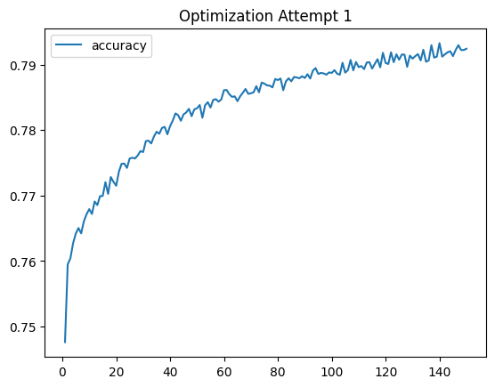

# deep-learning-challenge

## Overview
This purpose of this analysis was to use a neural network model to predict whether recipient organisations of seed funding will be successful. The model has been trained and tested on a .csv file of 34,000 organisations that have previously received funding.

## Results
The analysis employs a) a base model, and then b) three scaled optimization attempts. All models were trained and tested using the same source data.

### Pre-processing
- The target variable used in training and testing the model was the variable ``is_Successful`` indicating success outcome as 1 - Successful and 0 - not successful.

The input variables used to train and test the model included:

``NAME``

``APLICATION_TYPE`` 

``AFFILIATION`` - Affiliated sector of industry

``CLASSIFICATION`` - Government organisation classification

``USE_CASE`` - Use case for funding

``ORGANIZATION`` - Organisation type

``STATUS`` - Active status

``INCOME_AMT`` - Income classification

``SPECIAL_CONSIDERATIONS`` - Special considerations for application

``ASK_AMT`` - Funding amount requested

A further identification ID column ``EIN`` was dropped.

- The approach used a base model which was iteratively built upon using stepped-up optimization techniques.

### Base model

- Jupyter Notebook titled ``starter_code`` contains the base model.

- The ``APPLICATION_TYPE`` and ``CLASSIFICATION`` variables were binned with a new value called "Other" to capture rare values and make the variable easier to numericize.


- Categorical variables were made numeric using ``pd.get_dummies``

- The base model is fitted using 1 hidden layer, 27 neurons per layer (1 for each input variable) and a ReLU activation function that outputs to a sigmoid function due to the binary outcome prediction. The model was trained and tested for 100 epochs.

- Base model achieved a validation accuracy score of 72.59% and a loss rate of 55.56%. The model weights, and the model have been saved in to HDF5. 

- To achieve an accuracy score of over 75%, three optimization steps were used that adjusted the models hyperparameters. All three are saved in Jupyter Notebook titled ```AlphabetSoupCharity_Optimization.```

### Optimization Attempt 1 - Adjusted bins, added neurons, added epochs
- For all optimization attempts, the bins for ```AAPLICATION_TYPE``` and ```CLASSIFICATION``` were adjusted to lower the cutoff for an 'other' category, resulting in more categories, and hopefully, uncovering important patterns in the data. 

- Bins were also created for the ```NAME``` category, which was added into the model.

- The number of neurons was increased to reflect the neuron rule of thumb, but making it two times the amount of features after numericizing the categorical data. In this case, 190 neurons.

- The model ran for 150 epochs, up from 100 in the Base model.

- A ReLU activation function was used in the input and hidden layers.

- Optimization Attempt 1 achieved a validation accuracy score of 75.1% and a Loss rate of 60.5%. This broke through the >75% accuracy threshold that was the target.


### Optimization Attempt 2 - Adjusted bins, stepped neurons, added layer, added epochs
- Attempt 2 kept the same bin structure, but added a hidden layer. It also gradually increased the neuron amounts through the layers (Layer 1 = 95, Layer 2 = 190, Layer 3 = 285). This represented 1, 2 and 3 times the amount of input features respectively. It was done to allow the model to learn more complex relationships between the input features and the output variable.

- Attempt 2 achieved a validation accuracy score of 75.39% and a loss rate of 68.9%



### Optimization Attempt 3 - Adjusted bins,  increased neurons, added layer, added epochs
- Attempt 3 increased the neurons again to be three times the amount of input features, and kept the bin structure, added epochs and added layer.

- Attempt 3 also reduced the input features, to remove the ```CLASSIFICATION``` and ```SPECIAL_CONSIDERATIONS``` features, on the assumption that they were creating additional noise in the model and had no bearing on project success.

- The validation accuracy score dropped back below the 75% threshold, at 74.27% and a Loss rate of 69%.

- All attempts have been saved to HDF5 files.


## Summary
- The target model performance was achieved with a maximum accuracy of 75.39 in Optimization attempt 2, when an additional hidden layer was added. This is likely due to the fact that another layer was required to model complex, multi-dimensional data.

- The optimization attempts demonstrated the only variable that could be removed is ```EID```

- In this analysis, dropping input features ```CLASSIFICATION``` and ```SPECIAL_CONSIDERATIONS``` is not recommended

- Interestingly, the addition of the ```Name``` feature appeared to contribute to the model's target performance accuracy.

- Trying different activation functions appeared to make no difference to the performance.

- In summary, a model with multiple hidden layers should be used to solve this problem